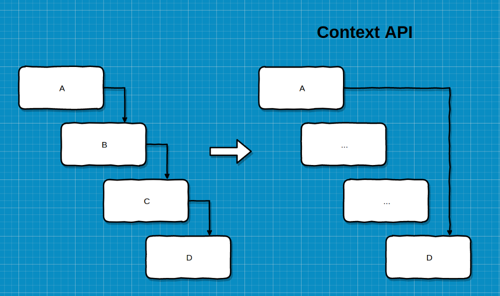
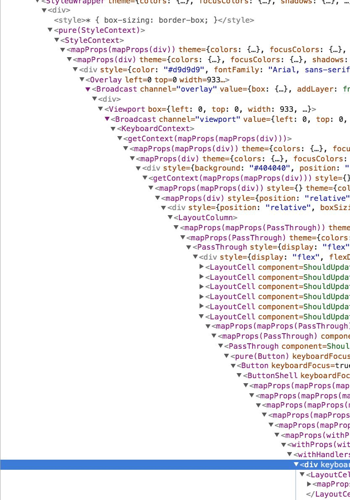

import { CodeSurfer } from "mdx-deck-code-surfer"
import { future } from "mdx-deck/themes"
import nightOwl from "prism-react-renderer/themes/nightOwl"
export { components } from "mdx-deck-code-surfer"
export const theme = {
 ...future,
 codeSurfer: {
   ...nightOwl,
   showNumbers: false
 }
}

# React
## Context & Hooks
---
# Context API

---
<CodeSurfer
  title="Props Hell"
  code={require("!raw-loader!./snippets/PropsHell.js")}
  steps={[
    { notes: "Exemplo" },
  ]}
/>
---

<CodeSurfer
  title="Provider"
  code={require("!raw-loader!./snippets/Context.js")}
  steps={[
    { notes: "Exemplo de componente em React usando Context" },
    { range: [3, 29], notes: "UserProvider" },
  ]}
/>
---
<CodeSurfer
  title="Consumer"
  code={require("!raw-loader!./snippets/UsingConsumerOldSchool.js")}
  steps={[
    { notes: "Utilizando consumer" },
    { lines: [10], notes: "Foco na gambiarra" },
  ]}
/>
---
<CodeSurfer
  title="Consumer usando Render Prop"
  code={require("!raw-loader!./snippets/UsingConsumer.js")}
  steps={[
    { notes: "Utilizando consumer render prop" },
    { range: [23, 25], notes: "Passando context via props" },
  ]}
/>
---
<CodeSurfer
  title="Consumer usando contextType"
  code={require("!raw-loader!./snippets/UsingContextType.js")}
  steps={[
    { notes: "Utilizando contextType" },
    { lines: [5], notes: "Utilizando contextType" },
    { range: [7, 9], notes: "Agora temos acesso ao contexto" },
    { lines: [12], notes: "Agora temos acesso ao contexto" },
  ]}
/>
---

# ⚠️
### Esta versão do context está disponível a partir da versão 16.3 do React

---

# React Hooks
<iframe src="https://giphy.com/embed/tYAolvs3tZIhG" width="480" height="288" frameBorder="0" class="giphy-embed" allowFullScreen></iframe>

---
## Problemas

<ul style={{ listStyle: 'none', textAlign: 'left' }}>
  <li style={{ fontSize: '46px', marginBottom: '20px'}}>😓 Classes no Javascript</li>
  <li style={{ fontSize: '46px', marginBottom: '20px'}}>♻️ Reutilização de lógica</li>
  <li style={{ fontSize: '46px', marginBottom: '20px'}}>📦 Componentes gigantes</li>
</ul> 

---

## ♻️ Reutilização de lógica

* Render props
* High Order Components (HOC)

---
## Wrapper Hell

---

<CodeSurfer
  title="Contador como HOC"
  code={require("!raw-loader!./snippets/CounterHOC.js")}
  steps={[
    { notes: "" },
    { range: [3, 30], notes: "HOC" },
    { range: [32, 42], notes: "Componente recebe via props" },
    { lines: [44], notes: "Wrapper withCounter(App)" },
  ]}
/>

---

<CodeSurfer
  title="Contador como Hooks"
  code={require("!raw-loader!./snippets/CounterHook.js")}
  steps={[
    { notes: "" },
    { range: [3, 10], notes: "Custom Hook" },
    { lines: [4], notes: "useState()" },
    { lines: [1], notes: "useState()" },
    { lines: [4], notes: "useState()" },
    { range: [5, 6], notes: "useState()" },
    { range: [8, 9], notes: "useState()" },
    { lines: [11], notes: "useState()" },
    { lines: [15], notes: "Utilizando ele no app" },
  ]}
/>

---

<CodeSurfer
  title="📦 Componentes gigantes"
  code={require("!raw-loader!./snippets/HugeComponent.js")}
  steps={[
    { notes: "" },
    { range: [8, 25], notes: "React Lifecycles" },
  ]}
/>

---

<CodeSurfer
  title="useEffect()"
  code={require("!raw-loader!./snippets/HugeComponentHook.js")}
  steps={[
    { notes: "" },
    { lines: [1], notes: "useEffect()" },
    { range: [7, 9], notes: "3 React Lifecycles dentro de useEffect" },
    { range: [12, 17], notes: "componentDidMount" },
    { lines: [13], notes: "componentDidMount" },
    { range: [14, 16], notes: "componentWillUnmount" },
    { lines: [17], notes: "componentDidUpdate" },
  ]}
/>

---

<CodeSurfer
  title="useContext()"
  code={require("!raw-loader!./snippets/UseContext.js")}
  steps={[
    { notes: "" },
    { lines: [5], notes: "useContext()" },
    { range: [7, 9], notes: "Acesso aos valores do context" },
    { lines: [11], notes: "Acesso aos valores do context" },
  ]}
/>

---

<CodeSurfer
  title="Custom Hooks"
  code={require("!raw-loader!./snippets/UseMedia.js")}
  steps={[
    { notes: "Renderiza um número diferente de colunas de acordo com a largura da tela" },
    { range: [1, 31], notes: "Renderiza um número diferente de colunas de acordo com a largura da tela" },
    { range: [25, 44], notes: "Renderiza um número diferente de colunas de acordo com a largura da tela" },
  ]}
/>

---

<CodeSurfer
  title="Custom Hooks"
  code={require("!raw-loader!./snippets/UseHistory.js")}
  steps={[
    { notes: "Lógica de desfazer e refazer uma ação no redux" },
    { range: [2, 5], notes: "useReducer()" },
    { range: [13, 31], notes: "useCallback" },
  ]}
/>

---

<CodeSurfer
  title="Custom Hooks"
  code={require("!raw-loader!./snippets/UseKeyPress.js")}
  steps={[
    { notes: "Detecção de qual tecla foi clicada pelo usuário" },
  ]}
/>

---

<ul style={{ listStyle: 'none', textAlign: 'left'}}>
  <li style={{ fontSize: '48px', marginBottom: '20px'}}>
    useReducer()
  </li>
  <li style={{ fontSize: '48px', marginBottom: '20px'}}>
    useCallback()
  </li>
  <li style={{ fontSize: '48px', marginBottom: '20px'}}>
    useMemo()
  </li>
  <li style={{ fontSize: '48px', marginBottom: '20px'}}>
    useRef()
  </li>
  <li style={{ fontSize: '48px', marginBottom: '20px'}}>
    useImperativeHandle()
  </li>
  <li style={{ fontSize: '48px', marginBottom: '20px'}}>
    useLayoutEffect()
  </li>
  <li style={{ fontSize: '48px', marginBottom: '20px'}}>
    useDebugValue()
  </li>
</ul>

---

## Regras
<ul style={{ listStyle: 'none', textAlign: 'left'}}>
  <li style={{ fontSize: '42px', marginBottom: '30px'}}>
    ❌ Não chamar Hooks dentro de loops, condicionais ou nested function.
  </li>
  <li style={{ fontSize: '42px', marginBottom: '30px'}}>
    ❌ Não chamar Hooks dentro de funções Javascript normais.
  </li>
  <li style={{ fontSize: '42px', marginBottom: '30px'}}>
    ✅ Chamar Hooks apenas Hooks de React function components.
  </li>
  <li style={{ fontSize: '42px', marginBottom: '30px'}}>
    ✅ Chamar Hooks dentro de Hooks customizados.
  </li>
  <li style={{ fontSize: '42px', marginBottom: '30px'}}>
    👍🏼 eslint-plugin-react-hooks
  </li>

  
</ul>

---

## Links úteis
[Documentação dos Hooks](https://reactjs.org/docs/hooks-intro.html)

[Apresentação dos Hooks na React Conf](https://www.youtube.com/watch?v=dpw9EHDh2bM)

[Egghead - React Context for State Management](https://egghead.io/courses/react-context-for-state-management)

[Egghead - Simplify React Apps with React Hooks](https://egghead.io/courses/simplify-react-apps-with-react-hooks)

[Egghead - Reusable State and Effects with React Hooks](https://egghead.io/courses/reusable-state-and-effects-with-react-hooks)

---

<iframe src="https://giphy.com/embed/26ufdipQqU2lhNA4g" width="480" height="480" frameBorder="0" class="giphy-embed" allowFullScreen></iframe>

#### Mais um oferecimento:
## Chapter de Front-End